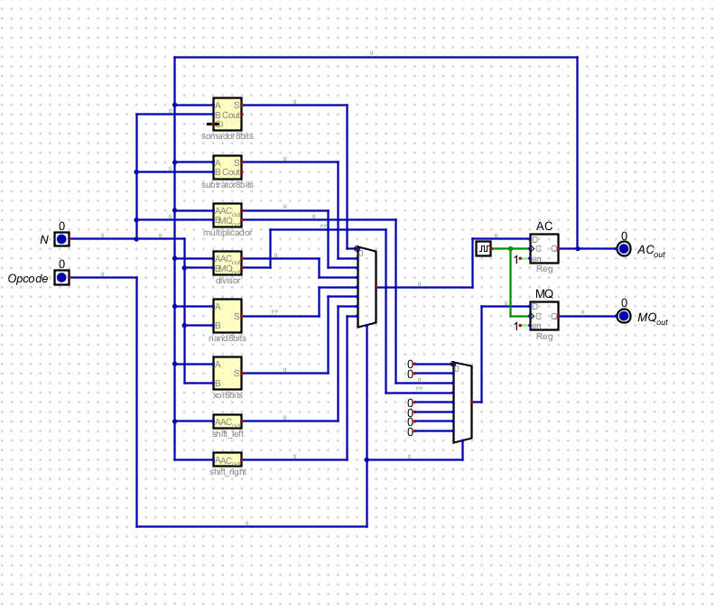
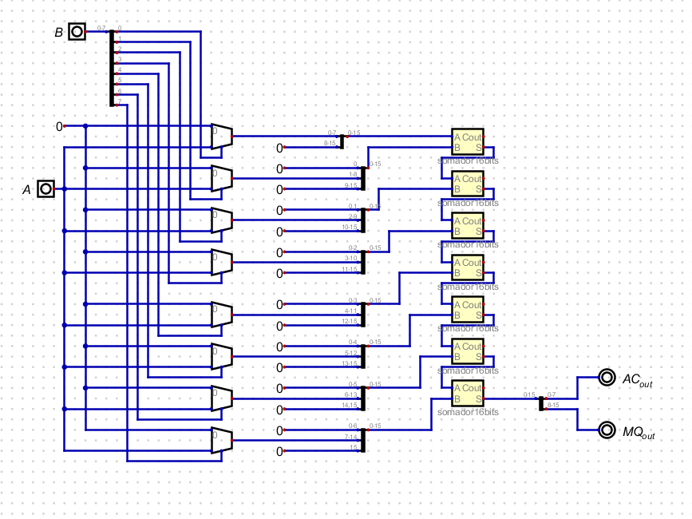
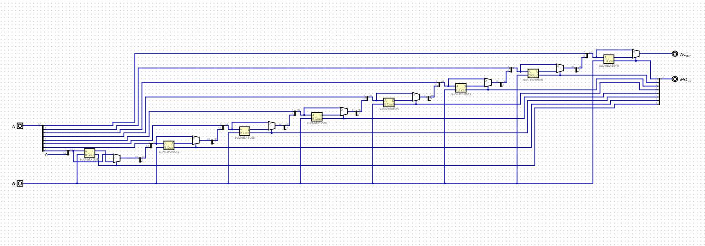
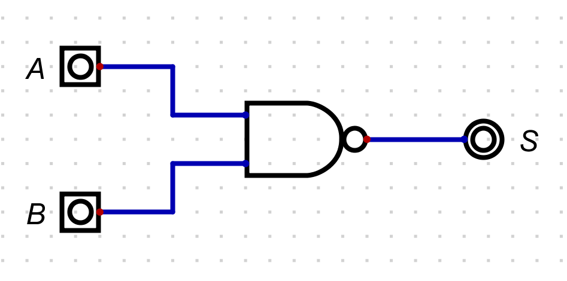
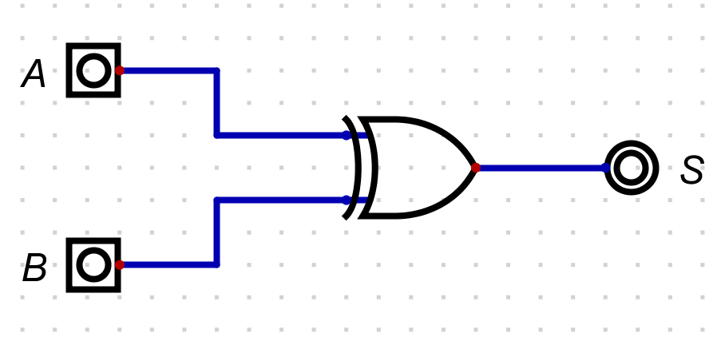

# ALU de 8 bits (arquivos `.dig`)

## Visão Geral do Projeto

Este projeto consiste na construção de uma **Unidade de Lógica e Aritmética (ALU) de 8 bits** desenvolvida do zero utilizando o software de simulação de circuitos lógicos **Digital**.

A ALU é o "cérebro" matemático e lógico de um processador e, por isso, é uma das partes fundamentais da arquitetura de computadores. O circuito foi projetado para realizar operações entre um **Registrador Acumulador (AC)** e uma **Entrada de dados (N)**. O resultado é armazenado de volta no **AC**. Dependendo da operação (como multiplicação e divisão), o resultado também utiliza um registrador auxiliar **MQ**.

Visão geral do circuito:

## Operações Suportadas

O circuito `dig/alu.dig` realiza operações bit a bit e aritméticas entre `AC` e `N`, usando `Opcode` (3 bits) para selecionar a operação.

- Soma: `AC + N` -> Resultado no `AC` (ver `imagens/Somador 8bits.png`)
- Subtração: `AC - N` -> Resultado no `AC` (ver `imagens/Subtrator 8bits.png`)
- Multiplicação: `AC * N` -> Metade menor (8 LSB) no `AC` e Metade maior (8 MSB) no `MQ` (ver `imagens/Multiplicador.png`)
- Divisão: `AC / N` -> Resto no `AC` e Quociente no `MQ` (ver `imagens/Divisor.png`)
- Shift Lógico: deslocamento de bits no `AC` (ver `imagens/Shift Left.png` e `imagens/Shift Right.png`)
- NAND: operação lógica bit a bit `AC NAND N` (ver `imagens/Nand.png`)
- XOR: operação lógica bit a bit `AC XOR N` (ver `imagens/Xor.png`)

## Como foi feito? (Arquitetura e Implementação)

Todo o projeto foi desenvolvido seguindo o princípio de **design hierárquico (Top-Down / Bottom-Up)**: primeiro são construídos circuitos simples, que depois viram "blocos" para montar circuitos maiores e mais complexos.

### Construção do Somador

A adição é a base para quase todas as operações matemáticas da ALU (inclusive a multiplicação). Para construir um somador de 8 bits, o projeto foi dividido em blocos:

Imagem do somador de 8 bits:

#### 1. Half Adder

No nível mais baixo da soma, o bloco trabalha com apenas dois bits isolados (`A` e `B`), gerando:

- Um XOR para calcular a soma do bit (pino `S`)
- Um AND para verificar se ambos são `1` e gerar o carry (pino `C`, como equivalente a `Carry Out`)

Imagem do half adder:

#### 2. Full Adder

O half adder sozinho não consegue somar um carry de uma operação anterior. Para resolver isso, foi construído o full adder a partir de:

- Dois half adders
- Uma porta OR para combinar os carrys possíveis

Ele recebe três entradas: `A`, `B` e `Ci` (Carry In). O output final do carry (`Co`) sai corretamente da combinação dos carrys gerados nos half adders.

Imagem do full adder:

O full adder é montado usando os **Half Adders** (do item anterior) e uma porta OR. O bloco completo do full adder é este (veja também `dig/fullAdder.dig`):

#### 3. Ripple Carry Adder (Somador de 8 bits)

Com o bloco do full adder pronto, o somador de 8 bits foi implementado em cascata:

- 8 full adders em sequência (do bit menos significativo até o mais significativo)
- `Splitters` para separar os 8 bits de `A` e `B` em sinais individuais
- O carry (`Co`) de um estágio é conectado ao carry de entrada (`Ci`) do estágio seguinte

Assim, o "vai um" percorre do LSB até o MSB, formando um somador completo e funcional.

### Implementação da Subtração

A subtração foi implementada com **reaproveitamento da mesma estrutura do somador**, usando complemento de dois no operando `B`.

Passos aplicados no `dig/subtrator8bits.dig`:

1. **Inversão de `B`**: todos os bits de `B` passam por portas `NOT`.
2. **Soma de 1**: uma constante `1` é ligada no `Ci` do primeiro full adder (LSB), injetando automaticamente o `+1`.
3. **Soma em cascata**: `A` e `B` convertido (`~B + 1`) entram na cadeia de 8 full adders.

Com isso, o circuito realiza `A - B` sem precisar de um bloco subtrator dedicado, apenas reutilizando a lógica de soma já construída.

Imagem do subtrator de 8 bits:

### Implementacao da Multiplicacão

A multiplicacao em hardware simula o metodo de multiplicar no papel (bit a bit), gerando parcelas e somando-as com alinhamento por deslocamentos.

Passos aplicados no `dig/multiplicador.dig`:

1. **Geracao de parcelas (seleção via Multiplexer)**: o circuito usa `Multiplexer` e `Splitters` para selecionar/juntar os bits de acordo com os bits do multiplicador (equivalente ao efeito de produtos parciais, sem depender explicitamente de portas `And` no arquivo `.dig`).
2. **Soma em cascata com somador 16 bits**: as parcelas alinhadas sao somadas em estagios sucessivos usando `somador16bits.dig`.
3. **Separacao do resultado de 16 bits em AC e MQ**: o resultado matematico da multiplicacao tem 16 bits; no circuito, ele e dividido em duas metades de 8 bits com `Splitters` (8 LSB -> `AC`, 8 MSB -> `MQ`).

Imagem do multiplicador:

### Implementacao da Divisão

A divisao foi implementada com a abordagem **Restoring Divider** (divisao por restauracao).

Passos aplicados no `dig/divisor.dig`:

1. **Cascata de 8 estagios**: o divisor é organizado como uma escadaria de 8 estagios idênticos, descendo o dado bit a bit para preparar a etapa seguinte.
2. **Subtracao e decisao (multiplexador)**: em cada estagio, um `subtrator8bits` tenta subtrair o divisor (entrada `N`) do valor atual. A decisao é feita pelo `Multiplexer` usando o pino `Cout`: se couber (nao dar negativo), a subtracao é mantida; se nao couber, o circuito restaura o valor anterior.
3. **Quociente e resto**: ao final dos 8 estagios, o valor de 8 bits restante é o **resto** direcionado para o `AC`, e o **quociente** é montado juntando os sinais de `Cout` gerados ao longo dos estagios, sendo enviado para o `MQ`.

Imagem do divisor:

### Operacoes Logicas (NAND e XOR)

As operacoes lógicas bit a bit comparam cada bit do `AC` com o bit correspondente da entrada `N` em paralelo.

No `dig/nand8bits.dig` e `dig/xor8bits.dig`, o design foi feito de forma direta e otimizada usando as portas nativas do simulador configuradas para 8 bits de dados, ao inves de criar manualmente uma matriz de portas e dividir fios um por um.

Imagens:

### Shift Logico (deslocamentos)

O projeto implementa duas variacoes do Logical Shift: **Left Shift** e **Right Shift**.

O deslocamento nao utiliza portas logicas tradicionais; ele é feito somente com roteamento e `Splitters`, descartando um bit e inserindo uma constante `0` no extremo oposto.

Shift Left (AC << 1):
1. Um `Splitter` fatia a entrada de 8 bits para descartar o MSB (bit 7).
2. O segundo `Splitter` reconstroi o barramento com uma `Const` de `0` inserida no bit 0.

Shift Right (AC >> 1):
1. Um `Splitter` fatia a entrada de 8 bits para descartar o LSB (bit 0).
2. O segundo `Splitter` reconstroi o barramento com uma `Const` de `0` inserida no bit 7.

## Módulos usados na ALU

A ALU agrega os módulos em arquivos `.dig` dentro de `dig/`, conectados por multiplexadores internos (o mapeamento exato do `Opcode` é definido por essas ligações).

- Visão geral da ALU: `dig/alu.dig` + `imagens/ALU__.png`
- Soma (somador 8 bits): `dig/somador8bits.dig` + `imagens/Somador 8bits.png`
- Subtração: `dig/subtrator8bits.dig` + `imagens/Subtrator 8bits.png`
- Multiplicação: `dig/multiplicador.dig` + `imagens/Multiplicador.png`
- Divisão: `dig/divisor.dig` + `imagens/Divisor.png`
- Shift Lógico: `dig/shift_left.dig` e `dig/shift_right.dig` + `imagens/Shift Left.png` e `imagens/Shift Right.png`
- NAND: `dig/nand8bits.dig` + `imagens/Nand.png`
- XOR: `dig/xor8bits.dig` + `imagens/Xor.png`

## Como testar

Para ver o processador funcionando em tempo real, abra o arquivo principal `dig/alu.dig` e inicie a simulação (botão **Play** na barra superior).

A partir daí, siga este passo a passo:

1. Escolha a operação
   Ajuste o valor de `Opcode` (3 bits) para selecionar o circuito desejado (ex.: `0` para Soma, `1` para subtração, `2` para Multiplicação, `3` para divisão).
2. Insira o dado
   Coloque um valor numérico na entrada `N` (8 bits).
3. Acione o Clock
   Clique (ou gere um pulso) no componente `Clock`. Isso faz com que os registradores capturem a resposta calculada.
4. Observe o resultado
   O valor da operação aparecerá na saída `AC_out`.
   Para operações de **Multiplicação** e **Divisão**, observe também `MQ_out`, que guarda a parte mais significativa do produto ou o quociente, respectivamente.

### Exemplo de Teste (Soma acumulada)

Defina `Opcode = 0` (Soma) e `N = 5`.

1. Dê um pulso no `Clock`.
   O `AC_out` mudará de `0` para `5`.
2. Dê um segundo pulso no `Clock`.
   O `AC_out` mudará para `10` (pois ele somou `5` da entrada com o valor previamente salvo no registrador acumulador).

